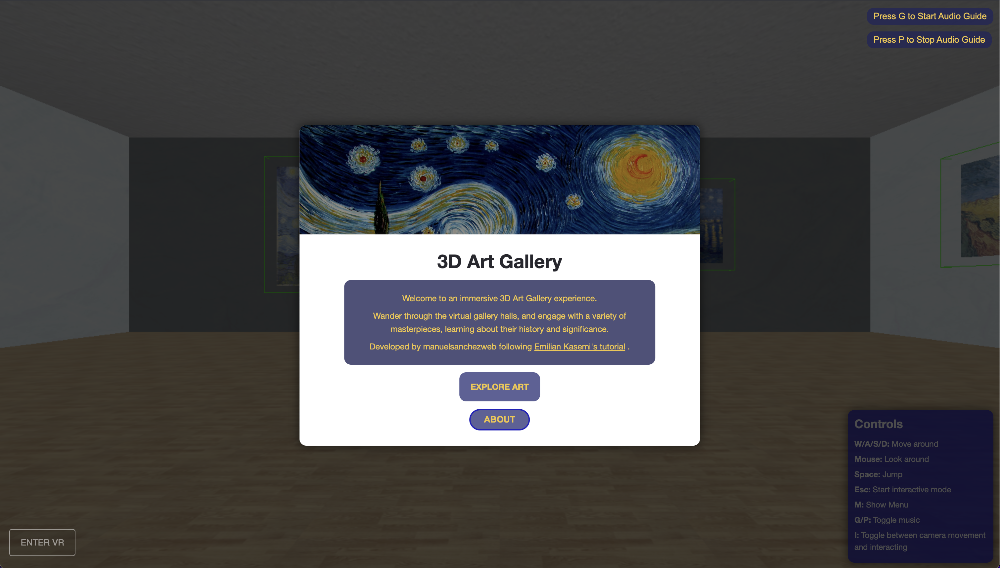

<div align="center">

[](https://art-gallery-threejs.vercel.app)

# 3D Art Gallery Tutorial using Three.js + TypeScript

</div>

This is a project I realized by following and extending [Emilian Kasemi's tutorial on YouTube](https://www.youtube.com/watch?v=vfMizAmPprs). My goal was to deep in the basics of Three.js so that I could create interactive projects.

## Installation

You need Node.js installed on your computer.
If you have any problem with the version, with 18 you should not have any problem.

```bash
  npm install
  npm run dev
```

## Features

[X] Freedom of movement in a Art Gallery 3D Environment
[X] Wall Collision with the character
[X] Possibility of jumping by pressing SPACE
[X] Toggling between interactive and moving mode with key 'i'
[X] Turn on/off some ambient music
[X] Add pictures (png) to the world through a config file
[X] Add videos (mp4) to the world through a config file
[X] Interaction with the pictures when closeness detected
[X] Interaction with the pictures when clicking them (url)
[X] Responsiveness through a joystick created with nipple.js
[ ] TODO: if interactive mode is enabled, character cannot move
[ ] TODO: send a feedback to the user to tell in which mode he is (interactive or movement)
[ ] TODO: clicking is only enabled if interactive mode is enabled
[ ] TODO: only show cursor if interactive mode is enabled
[ ] TODO: add a model that welcomes you to the gallery
[ ] TODO: add some more pictures and replace mock text
[ ] TODO: improve the textures of the walls, ceiling and floor

## YouTube Video

[Click here!](https://youtu.be/vfMizAmPprs)

## Authors

- [Manuel Sánchez](https://github.com/manuelsanchezweb)
- [Emilian Kasemi](https://www.github.com/theringsofsaturn)
